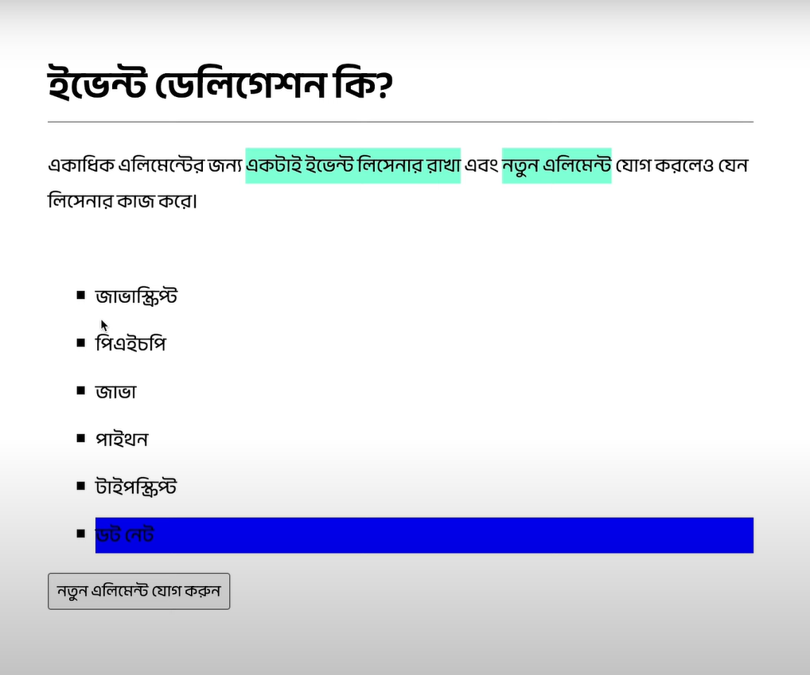

# Event handling

The Basic Event handler

```js
export default function Button() {
  function handleClick() {
    alert("You clicked me!");
  }

  return <button onClick={handleClick}>Click me</button>;
}
```

Functions passed to event handlers must be passed, not called. For example:

Correct => `<button onClick={handleClick}>`

Wrong=> `<button onClick={handleClick()}>`

The difference is subtle. In the first example, the `handleClick` function is passed as an `onClick` event handler. This tells React to remember it and only call your function when the user clicks the button.
when we need to pass arguments, we better do,

`<button onClick={() => handleClick(params)}>`

When we want to reuse button, we must follow this pattern,

```jsx
export default function App() {
  return (
    <Toolbar
      onPlayMovie={() => alert("Playing!")}
      onUploadImage={() => alert("Uploading!")}
    />
  );
}

function Toolbar({ onPlayMovie, onUploadImage }) {
  return (
    <div>
      <Button onSmash={onPlayMovie}>Play Movie</Button>
      <Button onSmash={onUploadImage}>Upload Image</Button>
    </div>
  );
}

function Button({ onSmash, children }) {
  return (
    <p>
      <button onClick={() => console.log(onSmash())}>{children}</button>
    </p>
  );
}
```

- onClick should be used only at the html button, not at Button.

# Children

In React, the `children` prop is a special prop used to pass content between the opening and closing tags of a component. This allows you to pass JSX or other React components as children, making it easy to create reusable components that can wrap and render different content dynamically.

In your code, the `Button` component uses the `children` prop to display whatever content is passed between its opening and closing tags. Here's how it works:

### Breakdown of `children` in Your Code

1. **Button Component:**

   ```jsx
   function Button({ onSmash, children }) {
     return (
       <p>
         <button onClick={() => console.log(onSmash())}>{children}</button>
       </p>
     );
   }
   ```

   - The `Button` component receives two props: `onSmash` and `children`.
   - `children` refers to whatever is placed inside the `Button` component when it is used.

2. **Using the Button Component:**

   In the `Toolbar` component:

   ```jsx
   <Button onSmash={onPlayMovie}>Play Movie</Button>
   <Button onSmash={onUploadImage}>Upload Image</Button>
   ```

   - For the first button, `Play Movie` is passed between the `Button` tags, which means `children` will be equal to the text `"Play Movie"`.
   - For the second button, `Upload Image` is passed, so `children` will be `"Upload Image"`.

3. **Rendering `children`:**

   Inside the `Button` component, `{children}` is used to display the content passed between the `Button` tags.

   ```jsx
   <button onClick={() => console.log(onSmash())}>{children}</button>
   ```

   When rendered:

   - The first button will display `"Play Movie"` as its text, because `children` is `"Play Movie"`.
   - The second button will display `"Upload Image"` as its text, because `children` is `"Upload Image"`.

### Key Concept: `children` in React

- `children` is useful when you want to make a component flexible enough to wrap any kind of content (text, elements, or other components).
- It's a way to make components reusable with different content inside them.

For example, you can pass text, JSX, or even another component as `children`:

```jsx
<Button onSmash={someFunction}>
  <strong>Click Me</strong>
</Button>
```

Here, the `children` will be the `<strong>Click Me</strong>` element.

# Event Delegation



# Event Propagation

### **Event Propagation**

Event propagation refers to the process by which an event (like a click) moves through the elements in the Document Object Model (DOM). When an event occurs on an element (like a button inside a `div`), it doesn't just affect that specific element—it can also affect its parent elements, grandparent elements, and so on. This movement of the event through the DOM tree is called **event propagation**.

Event propagation consists of three phases:

1. **Capturing Phase (Trickling)** – The event starts from the root of the DOM and travels down to the target element.
2. **Target Phase** – The event has reached the target element (the element that triggered the event).
3. **Bubbling Phase** – After the event reaches the target, it bubbles up from the target element back to the root of the DOM.

---

### **Event Phases**

1. **Capturing Phase (Trickling Phase)**:

   - In the capturing phase, the event moves **from the top (root)** of the DOM tree towards the **target element**.
   - It starts at the outermost parent and works its way down to the element that was clicked or interacted with.
   - You can use `onClickCapture` or similar event listeners in React to catch events in this phase.

2. **Target Phase**:

   - This is the phase where the event reaches the **target element**, the element that triggered the event (for example, a button that was clicked).
   - In this phase, event handlers attached directly to the target element are executed.

3. **Bubbling Phase**:
   - After the event has been triggered at the target element, it **bubbles up** through the DOM from the target element to the root, meaning it travels in reverse order through its ancestors.
   - By default, most event listeners in React (and in the DOM) handle events in the **bubbling phase**.
   - You can use `onClick` or similar event listeners to catch events in this phase.

---

### **Bubbling**

- **Bubbling** is when the event starts at the target element and "bubbles up" through its ancestors, moving up the DOM tree. For example, if you click a button inside a `div`, the `click` event will first trigger the button's handler and then bubble up to the `div`, and then further up the DOM tree.

  - Example of **bubbling**:

    ```html
    <div id="parent">
      <button id="child">Click me</button>
    </div>

    <script>
      document.getElementById("parent").addEventListener("click", () => {
        console.log("Parent clicked");
      });

      document.getElementById("child").addEventListener("click", () => {
        console.log("Child clicked");
      });
    </script>
    ```

    - When you click the button:
      - First, the `child` event handler is triggered.
      - Then, the event "bubbles up" to the `parent` and triggers the `parent` event handler.

    **Order of logs**:

    1. "Child clicked"
    2. "Parent clicked"

---

### **Capturing**

- **Capturing** (also known as **trickling**) is the reverse of bubbling. The event starts at the root of the DOM and travels down to the target element.
- Normally, events don’t trigger event handlers during the capturing phase unless specifically requested by using `addEventListener` with the third argument set to `true` or by using `onClickCapture` in React.

  - Example of **capturing**:

    ```html
    <div id="parent">
      <button id="child">Click me</button>
    </div>

    <script>
      document.getElementById("parent").addEventListener(
        "click",
        () => {
          console.log("Parent clicked (capturing)");
        },
        true // This enables capturing phase
      );

      document.getElementById("child").addEventListener("click", () => {
        console.log("Child clicked");
      });
    </script>
    ```

    - When you click the button:
      - The `parent` event handler is triggered first (because it’s in the capturing phase).
      - Then, the `child` event handler is triggered when the event reaches the target.

    **Order of logs**:

    1. "Parent clicked (capturing)"
    2. "Child clicked"

---

### **Difference Between Bubbling and Capturing**

| Bubbling                                                                                  | Capturing                                                                                                 |
| ----------------------------------------------------------------------------------------- | --------------------------------------------------------------------------------------------------------- |
| The event moves from the target element upwards to its ancestors in the DOM tree.         | The event moves from the root element downwards to the target element.                                    |
| Most events trigger event handlers in the bubbling phase by default in the DOM and React. | You need to explicitly specify the capturing phase using `addEventListener` or `onClickCapture` in React. |
| Event listeners in the bubbling phase are more commonly used.                             | Capturing is less common but useful when you want to handle events before they reach the target element.  |

---

### **Preventing Propagation**

In certain cases, you may want to stop an event from propagating further up or down the DOM tree. You can do this using two methods:

1. **`stopPropagation()`**:

   - This method prevents the event from **bubbling** up the DOM or **trickling** down during the capturing phase.
   - Once called, no further event listeners in either phase will be executed.

   ```javascript
   document.getElementById("child").addEventListener("click", (event) => {
     event.stopPropagation(); // Stops event from propagating further
     console.log("Child clicked");
   });
   ```

   - In this case, when you click the `child` element, only the `child` handler will execute, and the event will not propagate to the `parent`.

2. **`stopImmediatePropagation()`**:
   - This method not only prevents further propagation but also stops other listeners on the same element from being executed.

---

### **Event Phases in React**

In React, event propagation follows the same rules as native DOM events. However, React uses **synthetic events**, which are abstractions over the native events to ensure consistent behavior across different browsers. React supports both bubbling and capturing phases for events.

- **Bubbling phase**: This is the default phase in React for events like `onClick`, `onChange`, `onSubmit`, etc.
- **Capturing phase**: You can use the `onClickCapture`, `onChangeCapture`, etc., in React to handle events during the capturing phase.

---

### **Complete Example in React**

```jsx
import React from "react";

function EventPropagationExample() {
  const handleParentCapture = () => {
    console.log("Parent capturing");
  };

  const handleParentBubble = () => {
    console.log("Parent bubbling");
  };

  const handleChildClick = (event) => {
    event.stopPropagation(); // Stops bubbling
    console.log("Child clicked");
  };

  return (
    <div onClickCapture={handleParentCapture} onClick={handleParentBubble}>
      <button onClick={handleChildClick}>Click Me</button>
    </div>
  );
}

export default EventPropagationExample;
```

### Explanation:

- **`onClickCapture` on Parent**: This captures the event during the capturing phase.
- **`onClick` on Parent**: This catches the event during the bubbling phase.
- **`onClick` on Child**: This handles the event at the target element and stops propagation using `event.stopPropagation()`.

### Output:

1. When clicking the button:
   - "Parent capturing" will log first (capturing phase).
   - "Child clicked" will log next (target phase).
   - Bubbling is stopped by `stopPropagation()`, so "Parent bubbling" will not log.

---

### **Conclusion**

- **Event propagation** controls how events move through the DOM tree (either upwards or downwards).
- There are three phases: **capturing**, **target**, and **bubbling**.
- **Capturing** happens as the event trickles down to the target, while **bubbling** happens as the event propagates back up after reaching the target.
- You can stop propagation using `stopPropagation()` to control how events propagate in the DOM.

# Task

This `ColorSwitch` component renders a button. It’s supposed to change the page color. Wire it up to the `onChangeColor` event handler prop it receives from the parent so that clicking the button changes the color.

After you do this, notice that clicking the button also increments the page click counter. Your colleague who wrote the parent component insists that `onChangeColor` does not increment any counters. What else might be happening? Fix it so that clicking the button _only_ changes the color, and does _not_ increment the counter.

```jsx
export default function ColorSwitch({ onChangeColor }) {
  return (
    <button
      onClick={(e) => {
        e.stopPropagation();
        onChangeColor();
      }}
    >
      Change color
    </button>
  );
}
```
